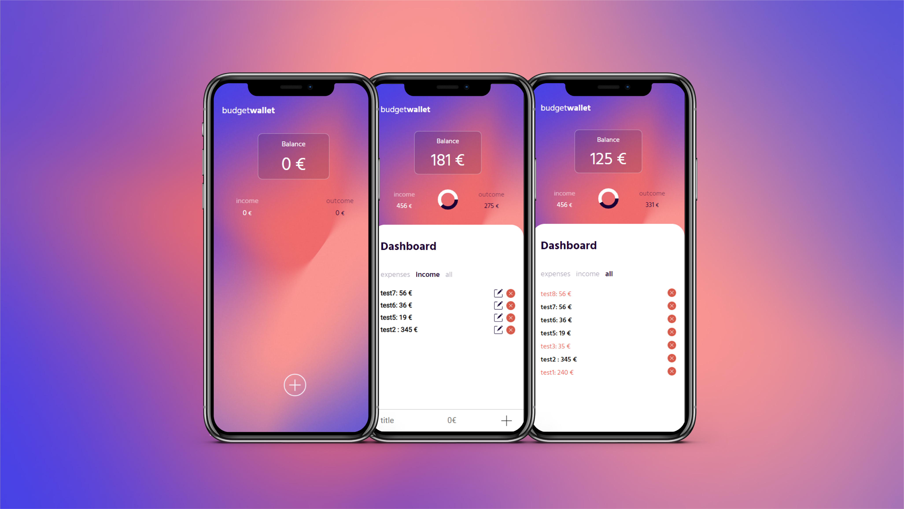

# wallet-app

_Budgeting app that calculates a budget based on a list of income and expenses._


_Code based on this https://github.com/codeexplainedrepo/?ref=morioh.com_

## Content

- Start
- Structure
- web images

## Start 🚀

_These instructions will allow you to obtain a copy of the running project on your local machine for development and testing purposes._

_To save this project:_

[Github documentation](https://help.github.com/es/github/creating-cloning-and-archiving-repositories/cloning-a-repository).

1. You are on the main page of the repository..
2. Under the repository name, click *clone* or *download*
3. To clone the repository with _HTTPS_, click "clone with HTTP".
4. Open the terminal and change to the location where you want the directory to be placed.
5. Write "git clone", and then paste the URL you copied in step 2.
```
$ git clone https://github.com/YOUR-USERNAME/YOUR-REPOSITORY
```
6. Press Enter (Intro). Your local clone will be created.
```
$ git clone https://github.com/YOUR-USERNAME/YOUR-REPOSITORY
> Cloning into `Spoon-Knife`...
> remote: Counting objects: 10, done.
> remote: Compressing objects: 100% (8/8), done.
> remove: Total 10 (delta 1), reused 10 (delta 1)
> Unpacking objects: 100% (10/10), done.
```
## structure

.
├── README.md
├── app.js
├── chart.js
├── images
│   ├── abstract.jpg
│   ├── add-1.png
│   ├── edit.png
│   ├── mas-1.png
│   ├── mas1.png
│   ├── preview.jpg
│   └── trash.png
├── index.html
└── stylesheets
    └── style.css


## web images 💻



 😀

---
⌨️ with ❤️ by [Maite Villar]